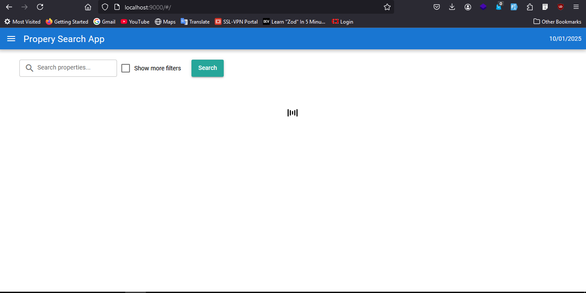
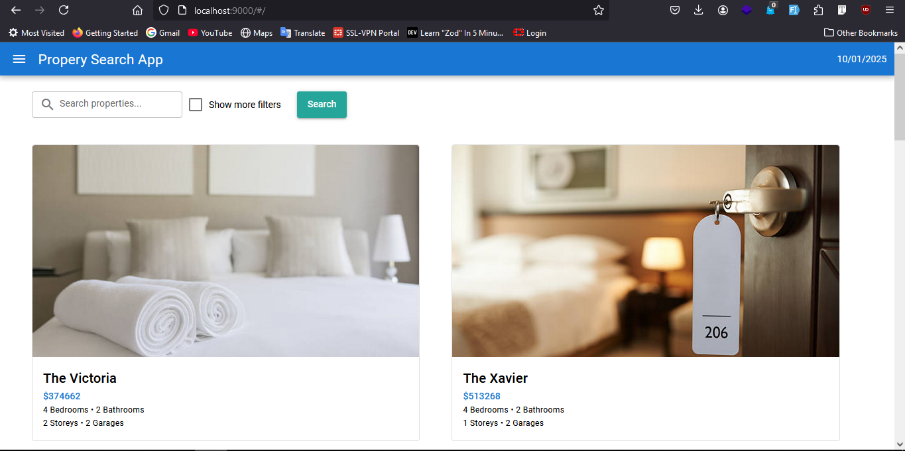
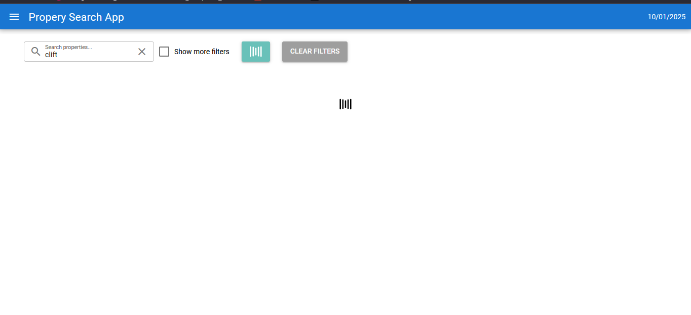
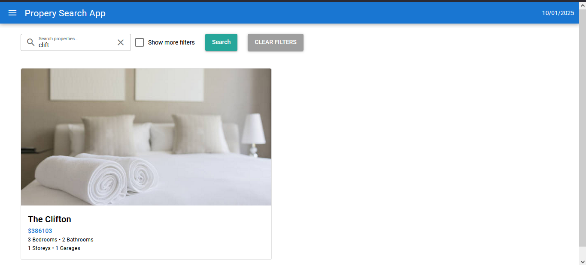
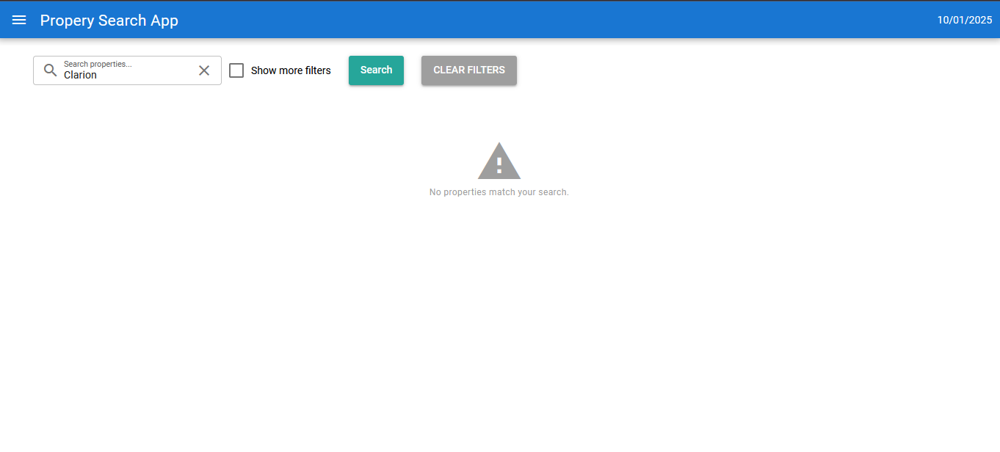
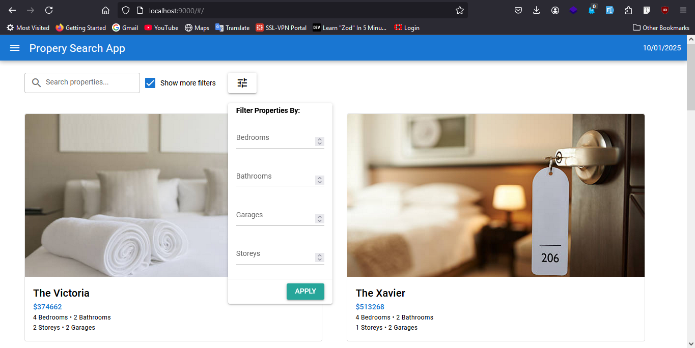
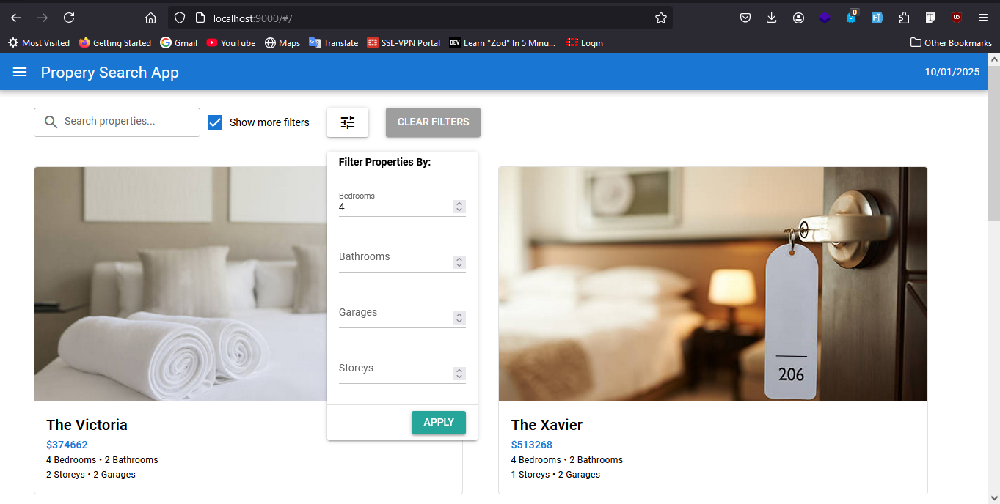

## Property Search App
This project contains the frontend for the search functionality of properties

### Clone the project

```bash
git clone https://github.com/KWangechi/property-frontend-dev-test.git
```

> NB: Remember to change the `baseUrl` of your backend in your `src/boot/axios.js`

### Start the app in development mode

```bash
npm run dev
```

### Screenshots
 - Spinning Loader on mount
 

 - Once Mounted
 

 - Searching
 

 - Search Results
 

 - No results
 

 - More filters
 

 - More filters results
 

